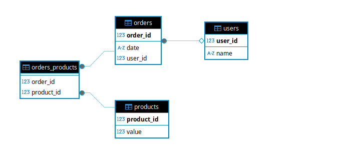

# Orders Translate

This project was made to receive a txt file and translate it into a json format, after being persisted in the database.


## :rocket: Technologies

* Java 21
* Spring Boot
* Spring Data Mysql
* Docker
## API Doc

### 📋 Requirements

API to work you will need to have installed

```
docker compose
curl
```

### 🔧 Installation

After cloning the repository, we need to enter the created directory and execute the command below, so the API and database will be started

```
docker compose up --build
```

## ⚙️ Running the tests

#### Endpoint para traduzir arquivos passando
Remembering that you need to update the file path in curl below, passing the absolut path, below is an example file inside the folder `/local`

```http
  curl --location 'http://localhost:8080/api/v1/translate/upload' --form 'file=@"/{PATH}/orders-translate/local/test-translate.txt"'

```
Once you have data entered, you can use the endpoints for consultation.
Endpoint to query from an `orderId`

```http
  curl --location 'http://localhost:8080/api/v1/{orderId}/orders'
```

Endpoint para consultar todos os perdidos

```http
  curl --location 'http://localhost:8080/api/v1/orders'
```

Para passar um filtro de data

```http
  curl --location 'http://localhost:8080/api/v1/orders?startDate={yyyy-MM-dd}&endDate={yyyy-MM-dd}'
```
## Entity Diagram


